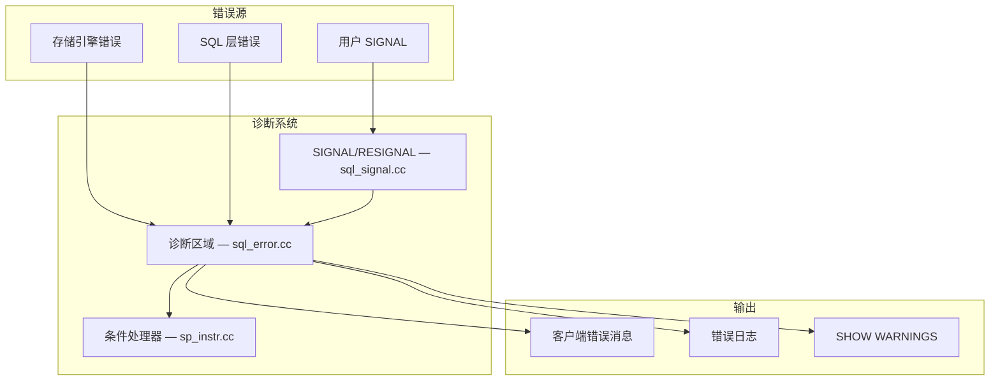
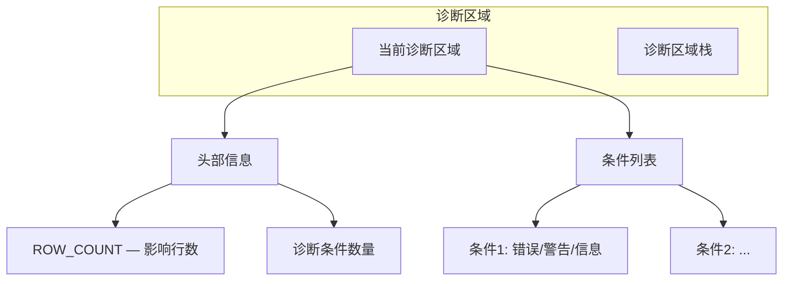
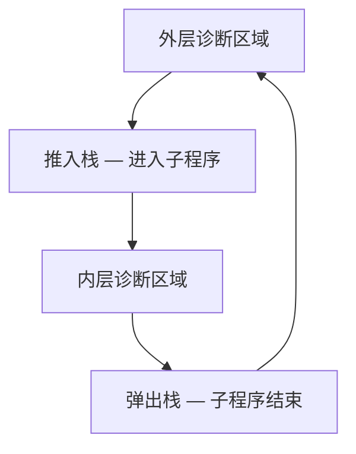
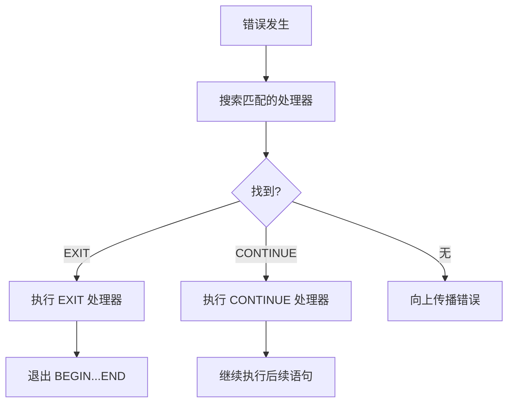

<cite>
**引用文件**
- [sql/sql_error.cc](file://sql/sql_error.cc)
- [sql/sql_error.h](file://sql/sql_error.h)
- [sql/sql_signal.cc](file://sql/sql_signal.cc)
- [sql/diagnostic_area.h](file://sql/diagnostic_area.h)
- [share/errmsg-utf8.txt](file://share/errmsg-utf8.txt)
- [include/my_sys.h](file://include/my_sys.h)
</cite>

## 目录
1. [错误处理概述](#错误处理概述)
2. [诊断区域（Diagnostic Area）](#诊断区域diagnostic-area)
3. [错误消息系统](#错误消息系统)
4. [SIGNAL 和 RESIGNAL](#signal-和-resignal)
5. [存储程序中的错误处理](#存储程序中的错误处理)
6. [SQL 模式](#sql-模式)
7. [客户端错误处理](#客户端错误处理)

## 错误处理概述

MySQL 的错误处理系统由诊断区域、错误消息库和条件处理器三部分组成，提供从底层引擎错误到用户可见信息的完整链路：



**Sources** · [sql/sql_error.cc](file://sql/sql_error.cc) · [sql/sql_signal.cc](file://sql/sql_signal.cc)

## 诊断区域（Diagnostic Area）

`sql_error.cc`（~42KB）实现诊断区域，存储当前语句产生的条件和警告信息：

### 结构



### 条件信息

每个诊断条件包含：

| 属性 | 说明 | 示例 |
|------|------|------|
| `MYSQL_ERRNO` | MySQL 错误编号 | 1062 |
| `SQLSTATE` | SQL 标准状态码 | `23000` |
| `MESSAGE_TEXT` | 错误消息文本 | "Duplicate entry '1' for key 'PRIMARY'" |
| `LEVEL` | 严重级别 | Error / Warning / Note |

```sql
-- 获取最近的诊断信息
SHOW WARNINGS;
SHOW ERRORS;

-- 使用 GET DIAGNOSTICS
GET DIAGNOSTICS CONDITION 1
  @errno = MYSQL_ERRNO,
  @state = RETURNED_SQLSTATE,
  @msg = MESSAGE_TEXT;

SELECT @errno, @state, @msg;
```

### 诊断区域栈

存储程序和触发器使用诊断区域栈来隔离内层和外层的错误信息：



**Sources** · [sql/sql_error.cc](file://sql/sql_error.cc) · [sql/diagnostic_area.h](file://sql/diagnostic_area.h)

## 错误消息系统

MySQL 的错误消息定义在 `share/errmsg-utf8.txt` 中，支持多语言：

### 错误编号范围

| 范围 | 类别 |
|------|------|
| 1000–1199 | 服务器内部错误 |
| 1200–1299 | 复制错误 |
| 1300–1399 | 存储引擎错误 |
| 1400–1599 | SQL 语法和语义错误 |
| 1600–1699 | 存储程序和触发器错误 |
| 3000–3199 | 数据字典错误 |
| 3500–3599 | JSON 相关错误 |
| 3600–3699 | GIS 相关错误 |
| 4000–4999 | 组件和插件错误 |

### SQLSTATE 映射

| SQLSTATE | 类别 |
|----------|------|
| `00000` | 成功 |
| `01000` | 警告 |
| `02000` | 未找到数据 |
| `22xxx` | 数据异常（除零、溢出等） |
| `23000` | 完整性约束违规 |
| `28000` | 认证错误 |
| `40001` | 序列化失败（死锁） |
| `42000` | 语法错误或权限不足 |
| `HY000` | 通用错误 |

**Sources** · [share/errmsg-utf8.txt](file://share/errmsg-utf8.txt)

## SIGNAL 和 RESIGNAL

`sql_signal.cc`（~17KB）实现存储程序中的异常抛出机制：

### SIGNAL

主动抛出一个条件（错误或警告）：

```sql
CREATE PROCEDURE check_balance(IN account_id INT, IN amount DECIMAL(10,2))
BEGIN
  DECLARE balance DECIMAL(10,2);
  SELECT current_balance INTO balance FROM accounts WHERE id = account_id;

  IF balance < amount THEN
    SIGNAL SQLSTATE '45000'
      SET MESSAGE_TEXT = 'Insufficient funds',
          MYSQL_ERRNO = 5001;
  END IF;

  UPDATE accounts SET current_balance = current_balance - amount
  WHERE id = account_id;
END;
```

### RESIGNAL

在条件处理器中重新抛出当前条件：

```sql
-- 捕获错误后记录日志，再重新抛出
DECLARE EXIT HANDLER FOR SQLEXCEPTION
BEGIN
  GET DIAGNOSTICS CONDITION 1 @msg = MESSAGE_TEXT;
  INSERT INTO error_log (error_msg, occurred_at) VALUES (@msg, NOW());
  RESIGNAL;  -- 重新抛出原始错误
END;

-- 修改消息后重新抛出
DECLARE EXIT HANDLER FOR SQLEXCEPTION
BEGIN
  RESIGNAL SET MESSAGE_TEXT = 'Wrapped: original error occurred';
END;
```

**Sources** · [sql/sql_signal.cc](file://sql/sql_signal.cc)

## 存储程序中的错误处理

存储程序和触发器使用 `DECLARE HANDLER` 语句定义条件处理器：

### 处理器类型

| 类型 | 行为 |
|------|------|
| `CONTINUE` | 执行处理器后继续执行后续语句 |
| `EXIT` | 执行处理器后退出当前 BEGIN...END 块 |
| `UNDO` | 回滚并退出（不支持，仅为兼容保留） |

### 条件匹配

```sql
-- 按 SQLSTATE 匹配
DECLARE CONTINUE HANDLER FOR SQLSTATE '23000' ...

-- 按错误编号匹配
DECLARE CONTINUE HANDLER FOR 1062 ...

-- 按预定义条件匹配
DECLARE EXIT HANDLER FOR SQLEXCEPTION ...       -- 任何异常
DECLARE EXIT HANDLER FOR SQLWARNING ...          -- 任何警告
DECLARE EXIT HANDLER FOR NOT FOUND ...           -- 未找到数据
```

### 处理流程



## SQL 模式

`sql_mode` 系统变量控制服务器的 SQL 行为和错误处理严格程度：

| 模式 | 说明 |
|------|------|
| `STRICT_TRANS_TABLES` | 事务表的严格模式 — 无效数据产生错误 |
| `STRICT_ALL_TABLES` | 所有表的严格模式 |
| `NO_ZERO_DATE` | 禁止零日期 `'0000-00-00'` |
| `NO_ZERO_IN_DATE` | 禁止日期中的零月/零日 |
| `ERROR_FOR_DIVISION_BY_ZERO` | 除零产生错误而非警告 |
| `NO_ENGINE_SUBSTITUTION` | 引擎不可用时报错而非替换 |
| `ONLY_FULL_GROUP_BY` | GROUP BY 严格模式 |
| `PIPES_AS_CONCAT` | `\|\|` 作为字符串连接 |
| `ANSI_QUOTES` | 双引号视为标识符 |

```sql
-- 推荐的生产模式
SET GLOBAL sql_mode = 'STRICT_TRANS_TABLES,NO_ZERO_DATE,NO_ZERO_IN_DATE,ERROR_FOR_DIVISION_BY_ZERO,NO_ENGINE_SUBSTITUTION';

-- 查看当前模式
SELECT @@sql_mode;
```

## 客户端错误处理

### C API 错误处理

| 函数 | 说明 |
|------|------|
| `mysql_error()` | 获取错误消息文本 |
| `mysql_errno()` | 获取错误编号 |
| `mysql_sqlstate()` | 获取 SQLSTATE |
| `mysql_warning_count()` | 获取警告数量 |

### 错误重试策略

| 场景 | 建议 |
|------|------|
| 死锁（1213） | 自动重试整个事务 |
| 锁等待超时（1205） | 短暂等待后重试 |
| 连接断开（2006/2013） | 重新连接后重试 |
| 重复键（1062） | 根据业务逻辑处理 |

**Sources** · [include/my_sys.h](file://include/my_sys.h)
