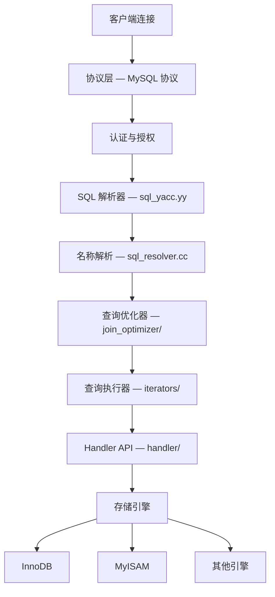
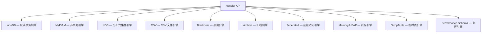

<cite>
**引用文件**
- [CMakeLists.txt](file://CMakeLists.txt)
- [MYSQL_VERSION](file://MYSQL_VERSION)
- [README](file://README)
- [sql/mysqld.cc](file://sql/mysqld.cc)
- [sql/sql_parse.cc](file://sql/sql_parse.cc)
- [sql/conn_handler/connection_handler_impl.h](file://sql/conn_handler/connection_handler_impl.h)
</cite>

## 目录
1. [项目简介](#项目简介)
2. [版本信息](#版本信息)
3. [项目目录结构](#项目目录结构)
4. [核心架构概览](#核心架构概览)
5. [SQL 处理流水线](#sql-处理流水线)
6. [存储引擎体系](#存储引擎体系)
7. [关键子系统](#关键子系统)
8. [客户端工具](#客户端工具)
9. [平台支持与依赖](#平台支持与依赖)

## 项目简介

MySQL Server 是全球最流行的开源关系型数据库服务器，由 Oracle 公司及其合作伙伴持续开发和维护。本项目为 MySQL Server 9.6.0 Innovation 版本的完整源代码仓库，提供了一个健壮、高性能的 SQL 数据库引擎，支持 ACID 事务、主从复制、表分区以及可插拔的存储引擎架构。

服务器进程（`mysqld`）实现了 MySQL 客户端/服务器协议，负责 SQL 查询的解析、优化、执行和结果返回。它支持多并发连接，每个连接由独立线程管理，并提供完善的身份认证、授权和审计功能。

**Sources** · [README](file://README) · [MYSQL_VERSION](file://MYSQL_VERSION)

## 版本信息

| 属性 | 值 |
|------|-----|
| 主版本号 (MAJOR) | 9 |
| 次版本号 (MINOR) | 6 |
| 补丁版本号 (PATCH) | 0 |
| 发布类型 | INNOVATION |
| 完整版本号 | 9.6.0 |

**Sources** · [MYSQL_VERSION](file://MYSQL_VERSION)

## 项目目录结构

```mermaid
graph TB
    ROOT[mysql-server]
    ROOT --> SQL[sql/ — SQL 层核心]
    ROOT --> STORAGE[storage/ — 存储引擎]
    ROOT --> CLIENT[client/ — 客户端程序]
    ROOT --> LIBMYSQL[libmysql/ — 客户端库]
    ROOT --> MYSYS[mysys/ — 系统抽象层]
    ROOT --> STRINGS[strings/ — 字符集与字符串]
    ROOT --> VIO[vio/ — 虚拟 I/O 层]
    ROOT --> PLUGIN[plugin/ — 插件系统]
    ROOT --> COMPONENTS[components/ — 组件架构]
    ROOT --> ROUTER[router/ — MySQL 路由器]
    ROOT --> INCLUDE[include/ — 公共头文件]
    ROOT --> EXTRA[extra/ — 第三方库]
    ROOT --> TEST[mysql-test/ — 测试套件]
    ROOT --> SQLCOMMON[sql-common/ — 共享协议代码]
    ROOT --> LIBBINLOG[libbinlogevents/ — 二进制日志事件库]
    ROOT --> LIBSERVICES[libservices/ — 插件服务库]
    ROOT --> LIBCHANGES[libchangestreams/ — 变更流库]
    ROOT --> UNITTEST[unittest/ — 单元测试]

    SQL --> SQL_AUTH[auth/ — 认证授权]
    SQL --> SQL_BINLOG[binlog/ — 二进制日志]
    SQL --> SQL_DD[dd/ — 数据字典]
    SQL --> SQL_ITERATORS[iterators/ — 行迭代器]
    SQL --> SQL_OPTIMIZER[join_optimizer/ — 查询优化器]
    SQL --> SQL_CONN[conn_handler/ — 连接处理]
    SQL --> SQL_GIS[gis/ — 空间/GIS]
    SQL --> SQL_PARTITIONING[partitioning/ — 分区]

    STORAGE --> INNODB[innobase/ — InnoDB]
    STORAGE --> MYISAM[myisam/ — MyISAM]
    STORAGE --> NDB[ndb/ — NDB 集群]
    STORAGE --> TEMPTABLE[temptable/ — 临时表]
    STORAGE --> PERFSCHEMA[perfschema/ — 性能模式]
```

**Sources** · [CMakeLists.txt:1-150](file://CMakeLists.txt#L1-L150)

## 核心架构概览

MySQL Server 采用分层架构设计，各层职责清晰分离：

架构分层说明：

| 层次 | 目录 | 职责 |
|------|------|------|
| 连接层 | `sql/conn_handler/` | 接受客户端连接（TCP/IP、命名管道、共享内存、Unix 套接字），采用每线程一连接模型并支持线程缓存 |
| 协议层 | `sql/` / `sql-common/` | 实现 MySQL 客户端/服务器协议，处理查询交互、结果集传输和预处理语句 |
| 认证层 | `sql/auth/` | 身份认证（SHA-256、caching_sha2_password、LDAP、Kerberos、FIDO2/WebAuthn、多因子认证）、ACL 管理、角色和权限检查 |
| 解析层 | `sql/sql_yacc.yy` | Bison 生成的 LALR(1) 解析器，将 SQL 文本转换为内部 AST（抽象语法树） |
| 语义分析层 | `sql/sql_resolver.cc` | 解析表/列引用、执行语义分析、对照数据字典验证 SQL |
| 优化层 | `sql/join_optimizer/` | 基于代价的优化器，确定最优连接顺序、访问方法和执行计划，包含超图连接优化器和范围优化器 |
| 执行层 | `sql/iterators/` | Volcano 模型迭代器执行引擎，通过迭代器树逐行处理数据（扫描、连接、排序、聚合、窗口等） |
| 存储引擎层 | `storage/` | 通过 Handler API 提供可插拔的存储引擎接口 |

**Sources** · [sql/mysqld.cc:80-200](file://sql/mysqld.cc#L80-L200) · [sql/sql_parse.cc:1-100](file://sql/sql_parse.cc#L1-L100) · [sql/conn_handler/connection_handler_impl.h:1-80](file://sql/conn_handler/connection_handler_impl.h#L1-L80)

## SQL 处理流水线

一条 SQL 查询在 MySQL Server 中的完整处理流程：

关键技术特征：
- **语言标准**：C++17，广泛使用 `std::optional`、`std::string_view`、结构化绑定等现代特性
- **解析器**：Bison LALR(1) 语法生成器（`sql_yacc.yy`，约 600KB）
- **内存管理**：`MEM_ROOT` 分配器用于查询作用域内的内存管理
- **序列化**：Protobuf 用于内部协议序列化
- **JSON 处理**：RapidJSON 库
- **性能监控**：PSI（Performance Schema Instrumentation）宏嵌入全代码

## 存储引擎体系

MySQL 支持可插拔的存储引擎架构，通过 Handler API（`sql/handler.h`）统一抽象：

**InnoDB**（`storage/innobase/`）是默认的事务型存储引擎，提供：
- MVCC（多版本并发控制）
- 行级锁定
- 外键约束
- 崩溃恢复
- 聚簇索引（基于主键的 B-tree）
- 内部子系统：B-tree（`btr/`）、缓冲池（`buf/`）、重做日志（`log/`）、锁管理器（`lock/`）、事务管理器（`trx/`）、数据字典（`dict/`）、文件管理器（`fil/`）、行操作（`row/`）

**MyISAM**（`storage/myisam/`）：非事务型引擎，适合读密集负载，支持全文索引和表级锁定。

**NDB**（`storage/ndb/`）：分布式、无共享的集群存储引擎，用于 MySQL Cluster。

**TempTable**（`storage/temptable/`）：为内部临时表优化的引擎。

**Memory/HEAP**（`storage/heap/`）：内存中的非持久化表。

**Performance Schema**（`storage/perfschema/`）：服务器监控和性能数据采集引擎。

**Sources** · [storage/innobase/CMakeLists.txt](file://storage/innobase/CMakeLists.txt) · [storage/](file://storage/)

## 关键子系统

### 数据字典（DD）
事务型数据字典（`sql/dd/`）将数据库对象（表、列、索引、视图、存储过程、触发器、事件）的元数据存储在内部 InnoDB 表中，取代了传统的基于 FRM/MYI/MYD 文件的元数据管理方式。

### 二进制日志与复制
二进制日志子系统（`sql/binlog/`、`libbinlogevents/`）记录所有数据变更操作，用于复制和时间点恢复。支持组提交（Group Commit）以提升性能，并与复制框架深度集成。

### 组件架构
组件基础设施（`components/`、`sql/server_component/`）提供了一种现代化的、模块化的服务器功能扩展方式。组件通过定义良好的服务接口进行通信，可以在运行时动态加载和卸载，无需重启服务器。主要组件类别包括：日志记录、密钥环（keyring）、连接控制、遥测等。

### 性能模式（PFS）
性能模式（`storage/perfschema/`、`include/pfs_*.h`）通过等待事件、阶段事件、语句事件、内存使用和元数据锁等维度对服务器进行运行时监控和诊断。

### 插件系统
插件架构（`plugin/`）支持服务器端扩展，包括：
- **认证插件**：caching_sha2_password、auth_socket、LDAP、Kerberos
- **组复制（Group Replication）**：多主和单主集群复制
- **克隆插件**：物理数据复制，用于数据同步和复制配置
- **审计插件**：事件审计和合规日志
- **半同步复制**：提高数据持久性的半同步复制方案
- **X 插件**：通过 X Protocol 提供文档存储访问

**Sources** · [sql/dd/dd.h](file://sql/dd/dd.h) · [sql/binlog/](file://sql/binlog/) · [components/](file://components/) · [plugin/](file://plugin/)

## 客户端工具

客户端工具集（`client/`）提供了丰富的数据库管理和运维工具：

| 工具 | 说明 |
|------|------|
| `mysql` | 交互式 SQL 命令行客户端，支持 readline |
| `mysqldump` | 逻辑备份工具，导出 SQL 语句 |
| `mysqladmin` | 服务器管理工具（启动/停止/状态/变量） |
| `mysqlbinlog` | 二进制日志查看和恢复工具 |
| `mysqlimport` | 批量数据导入工具（基于 LOAD DATA） |
| `mysqlshow` | 数据库/表信息查询工具 |
| `mysqlslap` | 负载模拟和基准测试工具 |
| `mysql_config_editor` | 登录路径管理，安全存储凭证 |
| `mysql_secure_installation` | 安全加固向导 |

**Sources** · [client/](file://client/)

## 平台支持与依赖

### 支持平台

| 平台 | 最低版本 | 编译器 | CMake |
|------|---------|--------|-------|
| Linux (RHEL) | 6–10 | devtoolset-11 (RHEL7)、gcc-toolset-14 (RHEL8/9)、gcc-13 (SUSE 15) | ≥ 3.17.5 |
| macOS | 11+ | Apple Clang (Xcode) | ≥ 3.19 (Xcode) |
| Windows | 10 / Server 2016+ | Visual Studio 2019+ (MSVC) | ≥ 3.17.5 |
| Solaris | 11 | GCC 11 | ≥ 3.17.5 |

### 第三方依赖

第三方库打包在 `extra/` 目录中，在 CMake 构建过程中从源代码编译：

| 库 | 用途 |
|-----|------|
| **Boost** | C++ 工具库、几何运算、program_options |
| **Abseil** | Google C++ 通用库 |
| **Protobuf** | Protocol Buffers 序列化 |
| **RapidJSON** | JSON 解析和生成 |
| **ICU** | Unicode 和国际化支持 |
| **LZ4 / Zstd** | 压缩算法 |
| **zlib** | 通用压缩库 |
| **curl** | HTTP 客户端（云集成） |
| **OpenSSL**（外部） | TLS/SSL 和加密 |
| **libfido2 / libcbor** | FIDO2/WebAuthn 认证 |
| **googletest** | 单元测试框架 |
| **libedit** | 命令行编辑 |
| **xxhash** | 快速哈希算法 |
| **gperftools** | 性能分析（tcmalloc） |

**Sources** · [extra/](file://extra/) · [CMakeLists.txt:1-150](file://CMakeLists.txt#L1-L150)
