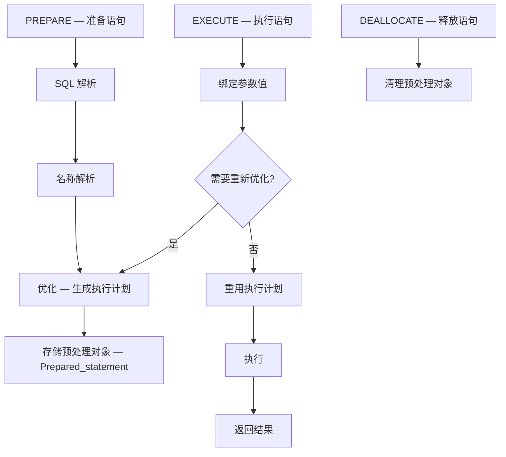
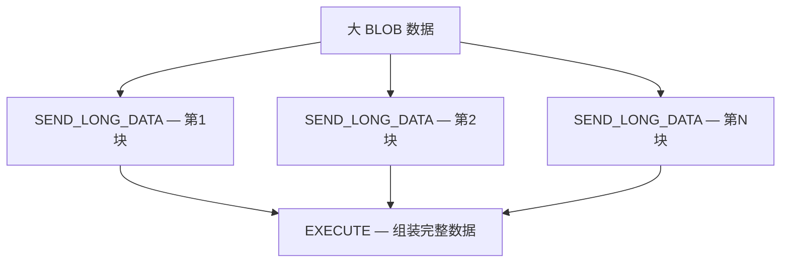

<cite>
**引用文件**
- [sql/sql_prepare.cc](file://sql/sql_prepare.cc)
- [sql/sql_hints.yy](file://sql/sql_hints.yy)
- [sql/sql_help.cc](file://sql/sql_help.cc)
- [sql/sql_reload.cc](file://sql/sql_reload.cc)
</cite>

## 目录
1. [预处理语句概述](#预处理语句概述)
2. [预处理生命周期](#预处理生命周期)
3. [协议层实现](#协议层实现)
4. [参数绑定与类型](#参数绑定与类型)
5. [查询提示（Optimizer Hints）](#查询提示optimizer-hints)
6. [FLUSH 命令](#flush-命令)

## 预处理语句概述

预处理语句（Prepared Statement）是 MySQL 的重要特性，核心实现在 `sql/sql_prepare.cc`（~131KB）中：

### 优势

| 特性 | 说明 |
|------|------|
| **性能** | 一次准备，多次执行 — 避免重复解析 |
| **安全** | 参数化查询 — 防止 SQL 注入 |
| **协议** | 二进制协议 — 减少网络开销 |
| **缓存** | 执行计划缓存 — 相同结构重用计划 |

**Sources** · [sql/sql_prepare.cc](file://sql/sql_prepare.cc)

## 预处理生命周期



### SQL 语法

```sql
-- 准备
PREPARE stmt FROM 'SELECT * FROM orders WHERE customer_id = ? AND order_date > ?';

-- 设置参数
SET @cid = 1001;
SET @odate = '2024-01-01';

-- 执行
EXECUTE stmt USING @cid, @odate;

-- 释放
DEALLOCATE PREPARE stmt;
```

### 协议命令

| 命令 | 代码 | 说明 |
|------|------|------|
| `COM_STMT_PREPARE` | 0x16 | 准备预处理语句 |
| `COM_STMT_EXECUTE` | 0x17 | 执行预处理语句 |
| `COM_STMT_CLOSE` | 0x19 | 关闭预处理语句 |
| `COM_STMT_RESET` | 0x1A | 重置预处理语句 |
| `COM_STMT_SEND_LONG_DATA` | 0x18 | 发送长数据（BLOB） |

**Sources** · [sql/sql_prepare.cc](file://sql/sql_prepare.cc)

## 协议层实现

### 二进制协议 vs 文本协议

| 特性 | 文本协议 | 二进制协议（预处理） |
|------|---------|---------------------|
| 命令 | `COM_QUERY` | `COM_STMT_EXECUTE` |
| 参数 | SQL 字符串拼接 | 二进制参数绑定 |
| 结果 | 全部文本 | 二进制结果集 |
| 类型转换 | 服务器端 | 客户端/服务器 |
| 网络效率 | 低 | 高 |

### 预处理对象

| 类 | 说明 |
|-----|------|
| `Prepared_statement` | 预处理语句对象 — 包含解析树和执行计划 |
| `Statement` | 语句基类 |
| `Item_param` | 参数占位符（`?`） |
| `Param_marker` | 参数标记 |

**Sources** · [sql/sql_prepare.cc](file://sql/sql_prepare.cc)

## 参数绑定与类型

### 参数类型

| MySQL 类型 | C 类型 | 说明 |
|-----------|--------|------|
| `MYSQL_TYPE_LONG` | `int` | 32位整数 |
| `MYSQL_TYPE_LONGLONG` | `long long` | 64位整数 |
| `MYSQL_TYPE_STRING` | `char*` | 字符串 |
| `MYSQL_TYPE_DOUBLE` | `double` | 双精度浮点 |
| `MYSQL_TYPE_DATETIME` | `MYSQL_TIME` | 日期时间 |
| `MYSQL_TYPE_BLOB` | `char*` | 二进制大对象 |
| `MYSQL_TYPE_NULL` | | NULL 值 |

### 绑定示例

```c
// C API 预处理语句
MYSQL_STMT *stmt = mysql_stmt_init(conn);
mysql_stmt_prepare(stmt, "INSERT INTO orders (customer_id, amount) VALUES (?, ?)", ...);

MYSQL_BIND bind[2];
memset(bind, 0, sizeof(bind));

int cid = 1001;
double amount = 99.99;

bind[0].buffer_type = MYSQL_TYPE_LONG;
bind[0].buffer = &cid;
bind[1].buffer_type = MYSQL_TYPE_DOUBLE;
bind[1].buffer = &amount;

mysql_stmt_bind_param(stmt, bind);
mysql_stmt_execute(stmt);
```

### 长数据传输



**Sources** · [sql/sql_prepare.cc](file://sql/sql_prepare.cc)

## 查询提示（Optimizer Hints）

`sql_hints.yy`（~18KB）实现 MySQL 查询提示的 Bison 解析器：

### 提示类型

| 提示 | 说明 | 示例 |
|------|------|------|
| `INDEX` | 强制使用索引 | `/*+ INDEX(t idx_name) */` |
| `NO_INDEX` | 禁止使用索引 | `/*+ NO_INDEX(t idx_name) */` |
| `JOIN_ORDER` | 指定 JOIN 顺序 | `/*+ JOIN_ORDER(t1, t2, t3) */` |
| `HASH_JOIN` | 使用 Hash Join | `/*+ HASH_JOIN(t) */` |
| `NO_HASH_JOIN` | 禁止 Hash Join | `/*+ NO_HASH_JOIN(t) */` |
| `MERGE` | 合并派生表 | `/*+ MERGE(dt) */` |
| `NO_MERGE` | 不合并派生表 | `/*+ NO_MERGE(dt) */` |
| `MRR` | 多范围读取 | `/*+ MRR(t idx) */` |
| `MAX_EXECUTION_TIME` | 最大执行时间 | `/*+ MAX_EXECUTION_TIME(1000) */` |
| `SEMIJOIN` | 半连接策略 | `/*+ SEMIJOIN(@subq FIRSTMATCH) */` |

```sql
-- 查询提示示例
SELECT /*+ INDEX(orders idx_date) HASH_JOIN(orders) */
    o.order_id, c.name
FROM orders o
JOIN customers c ON o.customer_id = c.id
WHERE o.order_date > '2024-01-01';

-- 设置最大执行时间
SELECT /*+ MAX_EXECUTION_TIME(5000) */ *
FROM big_table WHERE complex_condition;
```

**Sources** · [sql/sql_hints.yy](file://sql/sql_hints.yy)

## FLUSH 命令

`sql_reload.cc`（~21KB）实现 FLUSH 系列命令：

### FLUSH 操作

| 命令 | 说明 |
|------|------|
| `FLUSH TABLES` | 关闭所有打开的表 |
| `FLUSH PRIVILEGES` | 重新加载权限表 |
| `FLUSH LOGS` | 刷新所有日志文件 |
| `FLUSH STATUS` | 重置状态变量 |
| `FLUSH HOSTS` | 清空主机缓存 |
| `FLUSH OPTIMIZER_COSTS` | 重新加载优化器代价常量 |
| `FLUSH BINARY LOGS` | 轮换二进制日志 |
| `FLUSH ENGINE LOGS` | 刷新引擎层日志 |

```sql
-- FLUSH 命令
FLUSH TABLES WITH READ LOCK;  -- 全局读锁（备份用）
FLUSH LOGS;                    -- 日志轮换
FLUSH STATUS;                  -- 重置统计
```

**Sources** · [sql/sql_reload.cc](file://sql/sql_reload.cc) · [sql/sql_help.cc](file://sql/sql_help.cc)
